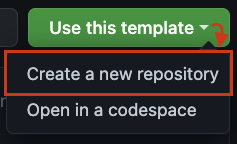

# Serko Exercise: Country Dropdown

**Welcome to this exercise repository.**

The intention for this exercise is to understand a bit more about how you work as a frontend focussed engineer.

We have designed this exercise to take approximately 2 hours of your time.
If the exercise is not completed in full, feel free to add some notes as a markdown file explaining why and how you would have continued with more time.

---

## Creating your workspace
We are utilising Github's template repository feature. Please create your own copy of this repository by clicking the **"Use this Template"** button and selecting the **"Create a new repository"** option.

When you are done, please submit the URL to your Github repo back to us.

---

## Where to start
- Please head over to read the [instructions](INSTRUCTIONS.md)
- Also consider the [context](CONTEXT.md) file we have provided for your notes
- Familiarise yourself with the [Figma design file](https://www.figma.com/file/WFMXl8yxXxaBSIZomBxMaE/Country-select-exercise?node-id=0%3A1&t=RrNUTcCA67HM6gnC-0) that shows the desired outcome
  - We have added 2 preview screenshots to this repository but the Figma design file is the source of truth and contains all values, like colours or padding, needed to build the components
  - [Dropdown states preview](Dropdown%20states%20preview.png)
  - [Dropdown values preview](Dropdown%20values%20preview.png)

---

## How to get running

### Prerequisites
- Node LTS, we have tested this exercise using version 18.x

### Running code
In order to save time with project setup, we have created a minimal sandbox environment using Vite. This should allow you to jump straight into solving the problem and not need to spend time setting up the basic tools and dev server.

1. `npm install` to install the dependencies required
2. `npm run dev` to launch the Vite powered dev server for local development

MSW has been pre-configured with the appropriate mock data to simulate an API. You can see the result in your browser's console once the dev server is running. 

Types for this mock API have been provided in the `src/types/api.d.ts` file. The `src/utils` folder contains a basic fetch function for demonstration purposes. You are welcome to use these utility functions or create your own.